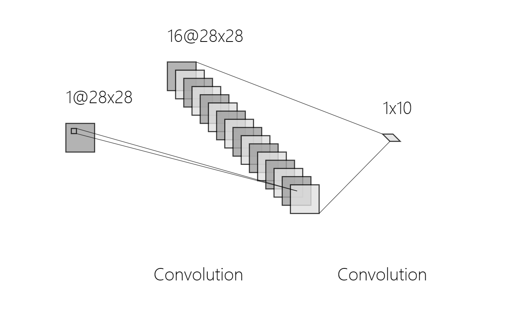
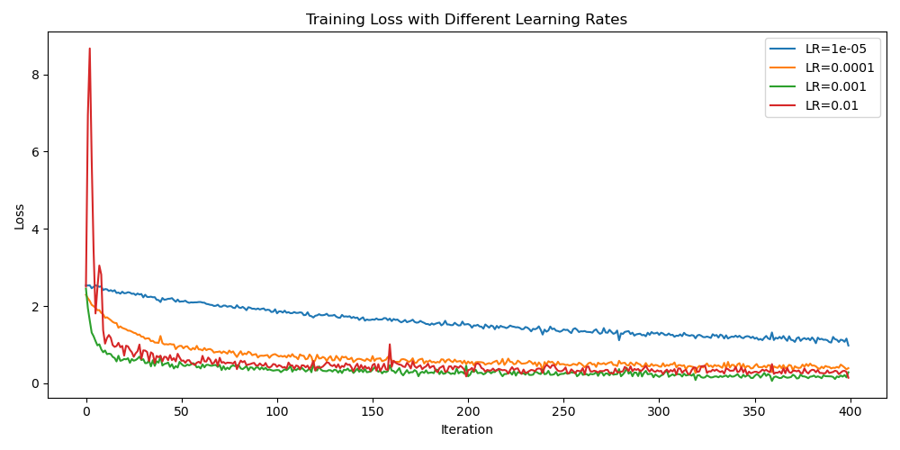
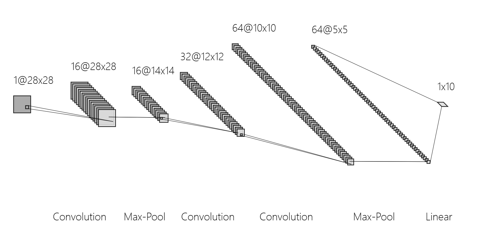
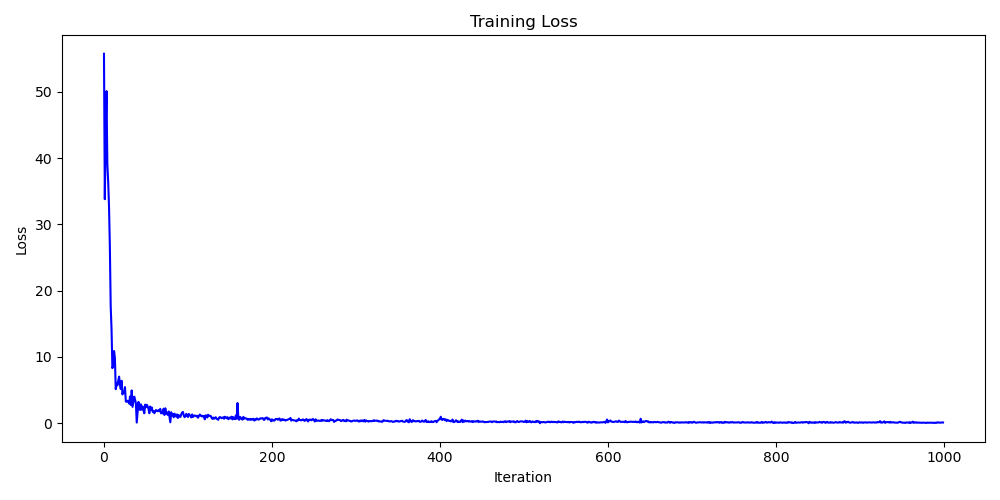
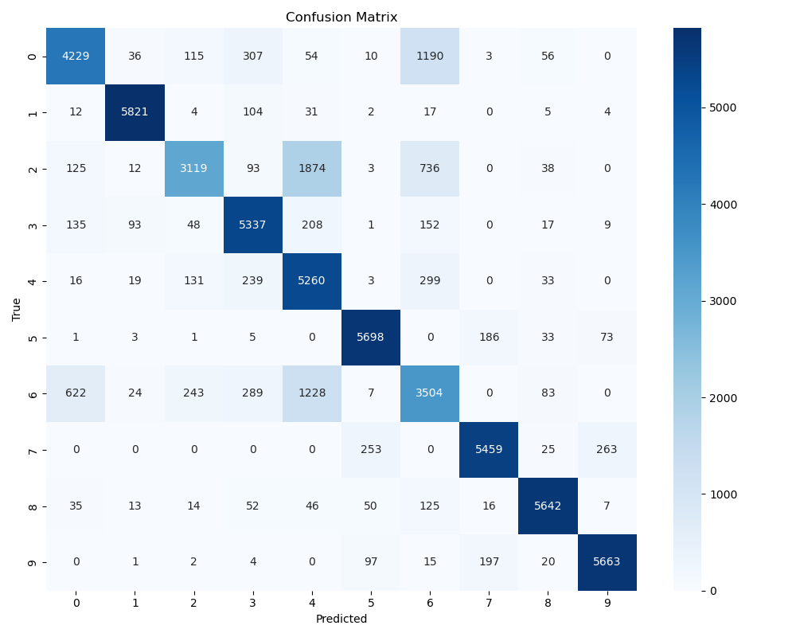
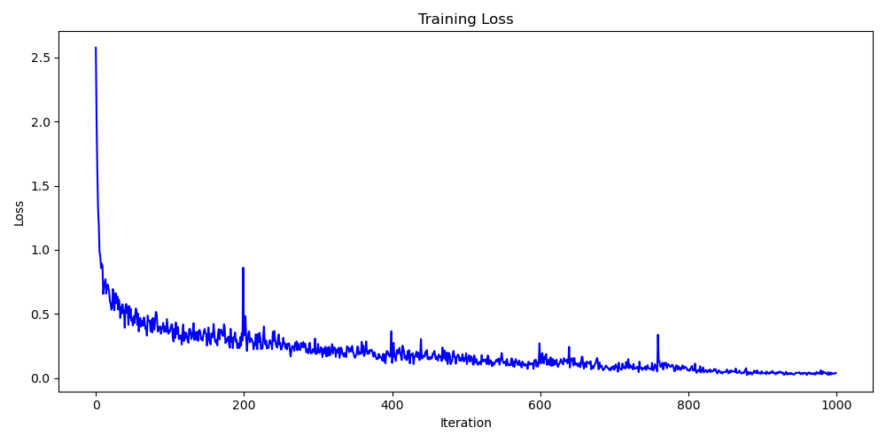
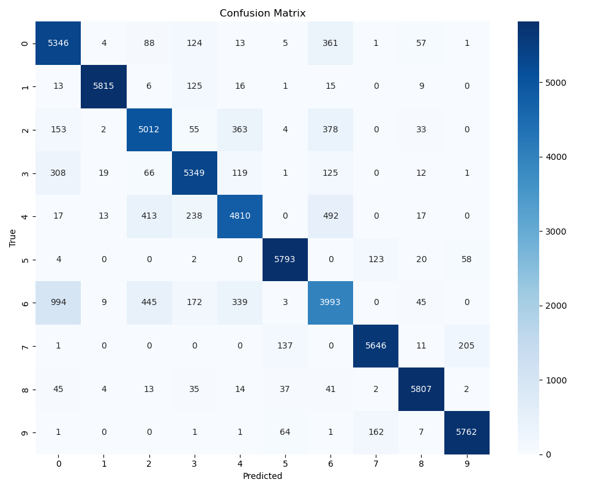

### 比较不同网络的学习率

1. ##### 简单CNN网络

   网络结构1个卷积层+1个全连接层

   

   训练轮数：400轮

   | 学习率 | 0.00001 | 0.0001 | 0.001  | 0.01   |
   | ------ | ------- | ------ | ------ | ------ |
   | 准确率 | 71.24%  | 84.63% | 87.12% | 86.93% |

   

2. ##### 复杂CNN网络

   网络结构：3个卷积层+2个池化层+1个全连接层

   

   训练轮数：400轮

   | 学习率 | 0.00001 | 0.0001 | 0.001  | 0.01   |
   | ------ | ------- | ------ | ------ | ------ |
   | 准确率 | 71.24%  | 84.63% | 87.12% | 86.93% |

----

### 单测网络准确率

轮数：1000

学习率：0.001

BATCH_SIZE：256

1. ##### 简单CNN网络

   准确率：83.76%

   训练耗时：16.06秒

   loss曲线：

   

   混淆矩阵：

   

   

2. ##### 复杂CNN网络

   准确率：88.89%

   训练耗时：59.64秒

   loss曲线：
   
   
   
   混淆矩阵：
   
   