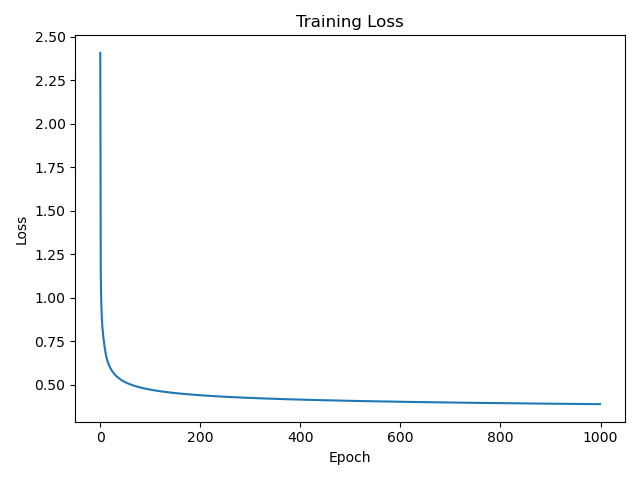
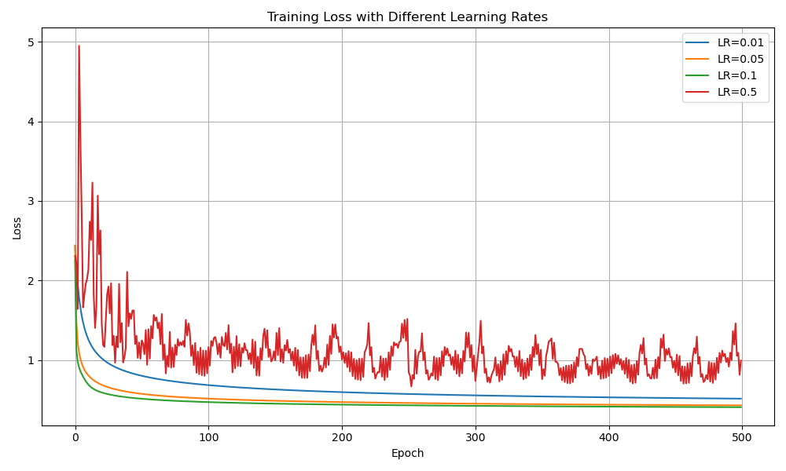
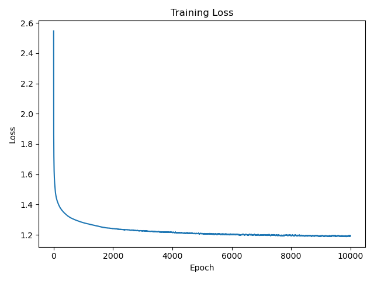
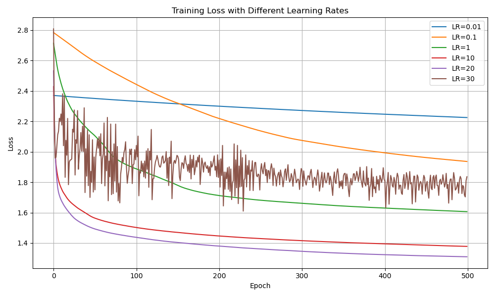
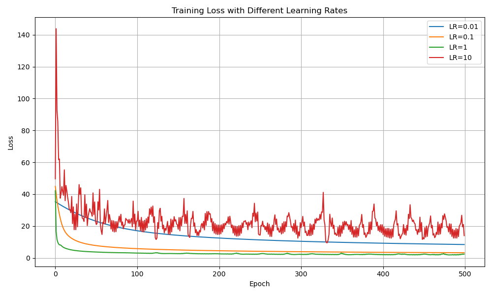
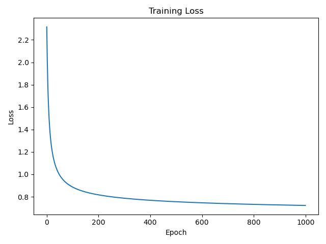
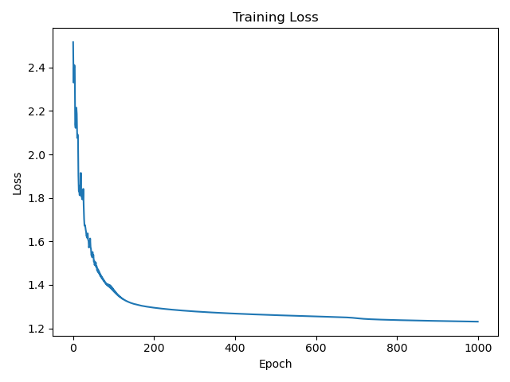
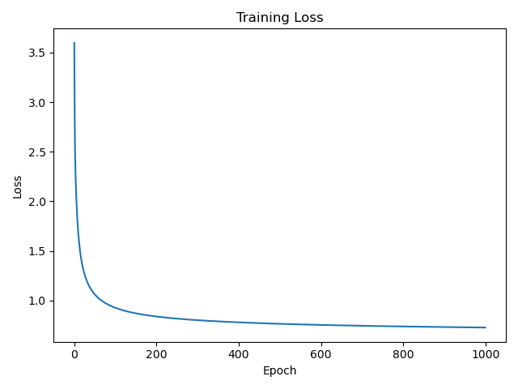

**主观总结：**

直接使用像素值特征时，线性核有较好的表现，sigmoid核效果不佳，多项式核在次数为1时，等同于线性核，效果近似；更高次数的多项式核无法获得正确的结果。

提取HOG特征后，训练速度提升非常明显，sigmoid核的效果显著增强，但其他两个核的效果有所下降。

----

### 像素值特征

1. #### 线性核

   - **基础测试：**学习率：0.1，训练轮次：1000

     最终loss：0.3897，准确率：84.36%

   

   - **改变学习率测试**：学习率0.01、0.05、0.1、0.5

   

2. #### Sigmoid核

   - 基础测试：学习率20，训练轮次10000

     最终loss：1.1925，准确率：60.43%

   

   - **改变学习率测试**：学习率取值：0.01, 0.1, 1, 10, 20, 30

   

3. #### 多项式核

- 基础测试：学习率1，训练轮次1000（速度慢，次数为1，效果与线性核接近）

  最终loss：2.0197，准确率：78.43%

- **改变学习率测试**：学习率取值：0.01, 0.1, 1, 10

### HOG特征

提取hog特征后，训练速度提升明显

1. #### 线性核

   学习率：5，训练轮次：1000

   最终loss：0.7222，准确率：73.32%

2. #### sigmoid核

学习率：15，训练轮次：1000

最终loss：1.2309，准确率：69.15%

3. #### 多项式核

学习率：5，训练轮次：1000

最终loss：0.7275，准确率：72.92%

